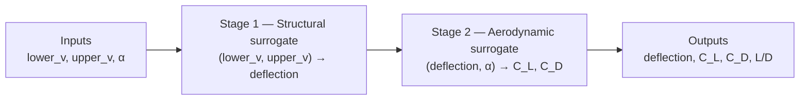

# ML Pipeline Guide — Piezoelectric Morphing Wing Surrogates

This document explains the full machine-learning workflow for the IDP project: what data is used, how the two surrogate models are trained and evaluated, how synthetic augmentation fits in, and how predictions flow from MFC voltages to aerodynamic coefficients.

---

## Table of contents

1. [System overview](#1-system-overview)
2. [Pipeline architecture](#2-pipeline-architecture)
3. [Input datasets](#3-input-datasets)
4. [The two surrogate models](#4-the-two-surrogate-models)
5. [Training scripts and when to use them](#5-training-scripts-and-when-to-use-them)
6. [Synthetic data augmentation](#6-synthetic-data-augmentation)
7. [Leak-free training protocol (recommended)](#7-leak-free-training-protocol-recommended)
8. [Train vs test split — detailed breakdown](#8-train-vs-test-split--detailed-breakdown)
9. [Why structural train = 587 rows but aerodynamic train = 3,254 rows](#9-why-structural-train--587-rows-but-aerodynamic-train--3254-rows)
10. [Hyperparameter tuning and metrics](#10-hyperparameter-tuning-and-metrics)
11. [Evaluation vs deployment models](#11-evaluation-vs-deployment-models)
12. [Forward and inverse prediction](#12-forward-and-inverse-prediction)
13. [Project file map](#13-project-file-map)
14. [How to run the pipeline](#14-how-to-run-the-pipeline)
15. [Current model performance (strict mode)](#15-current-model-performance-strict-mode)

---

## 1. System overview

The project models a **piezo-actuated NACA 0009 morphing wing**. Macro Fiber Composite (MFC) actuators apply voltages to bend the trailing edge. That shape change affects aerodynamic lift and drag.

**Physical chain:**

```
(lower MFC voltage, upper MFC voltage)
        ↓  structural mechanics (ANSYS)
trailing-edge deflection (mm)
        ↓  at a given angle of attack
(C_L, C_D)  aerodynamic coefficients (CFD)
```

Because high-fidelity ANSYS and CFD simulations are expensive, we train **surrogate models** — fast ML approximations of those simulations — and chain them together for real-time prediction and control.

**Fixed wing parameters (not model inputs):**

| Parameter | Value |
|-----------|-------|
| Airfoil | NACA 0009 |
| Chord | 127 mm |
| Morphing region | Trailing edge (80% chord) |
| MFC type | M-8557 P1 (d33 mode) |
| Voltage range | −500 V to +1500 V |

---

## 2. Pipeline architecture

The production pipeline is a **two-stage forward model**:



Implemented in `surrogate_chain.py` as class `SurrogateChain`:

1. **Structural model** predicts deflection from voltages.
2. **Aerodynamic model** predicts C_L and C_D from deflection and angle of attack.
3. Voltages are **not** direct inputs to the aerodynamic model in the deployed chain — only deflection and angle of attack are.

The Flask web app (`app.py`) and CLI tools (`predict_cl_cd.py`, `recommend_voltages.py`) both use this chain.

---

## 3. Input datasets

Two real simulation datasets drive all training.

### 3.1 Structural dataset — `Structure samples.xlsx`

| Property | Value |
|----------|-------|
| Source | ANSYS structural simulation |
| Rows after loading | **300** |
| Lower MFC voltage | −500 V to −50 V (50 V steps) |
| Upper MFC voltage | 50 V to 1500 V (50 V steps) |
| Output | Trailing-edge deflection (mm) |
| Deflection range | ≈ −0.37 mm to −8.47 mm |

Loaded by `load_structure_samples()` in `data_loaders.py`. The Excel sheet contains four blocks of `(lower_v, upper_v, deflection)` triplets that are concatenated into one table.

### 3.2 Aerodynamic dataset — `C_L C_D Values - Sheet1.csv`

| Property | Value |
|----------|-------|
| Source | CFD simulation |
| Rows after parsing | **201** |
| Lower MFC voltage | −500 V to −50 V (50 V steps) |
| Upper MFC voltage | **50 V, 750 V, 1500 V only** (sparse) |
| Angles of attack | −4°, 0°, 4°, 8°, 12°, 16°, 20° |
| Outputs | C_L, C_D |
| C_L range | 0.004 – 0.308 |
| C_D range | 0.013 – 0.140 |

Loaded by `load_cfd_dataset()` in `data_loaders.py` / `load_cfd_data.py`. The CSV is hierarchical (voltage header rows followed by angle-of-attack sweeps); the loader flattens it into one row per `(voltages, deflection, angle of attack, C_L, C_D)` combination.

---

## 4. The two surrogate models

### 4.1 Structural surrogate

| | |
|---|---|
| **Mapping** | `(lower_mfc_v, upper_mfc_v) → deflection_mm` |
| **Selected model** | Linear Regression (with StandardScaler) |
| **Why linear wins** | Structural response is nearly linear in voltage space; R² ≈ 0.999998 on held-out test data |
| **Saved artifact** | `outputs_augmented_models/retrained_strict/structural_linear_regression.joblib` |

Angle of attack is irrelevant to structural deflection in this dataset — only voltages matter.

### 4.2 Aerodynamic surrogate

| | |
|---|---|
| **Mapping** | `(deflection_mm, pitch_deg) → (C_L, C_D)` |
| **Selected model** | MLP Regressor — 2 hidden layers (128, 64), ReLU, Adam |
| **Why MLP wins** | Aerodynamic response is nonlinear, especially for C_D; MLP outperforms linear regression on augmented data |
| **Saved artifact** | `outputs_augmented_models/retrained_strict/aerodynamic_mlp_regressor.joblib` |

Both models are wrapped in scikit-learn `Pipeline` objects: `StandardScaler` → regressor.

An alternative feature set `(lower_v, upper_v, α) → (C_L, C_D)` exists in `train_aerodynamic_surrogates.py` for direct-voltage experiments, but the **deployed chain uses deflection + angle of attack**.

---

## 5. Training scripts and when to use them

The project has three training entry points:

| Script | Purpose | Data used |
|--------|---------|-----------|
| `train_structural_surrogates.py` | Baseline structural training | 300 real ANSYS rows only |
| `train_aerodynamic_surrogates.py` | Baseline aerodynamic training | 201 real CFD rows only |
| `train_augmented_surrogates.py` | **Recommended** — leak-free augmented retraining with CV and tuning | Real split + synthetic augmentation |

### Baseline scripts (real data only)

Both baseline scripts use a simple **80/20 random split** (`test_size=0.2`, `random_state=42`):

- Structural: 240 train / 60 test
- Aerodynamic: 160 train / 41 test

They train Linear Regression and MLP side-by-side and save to `outputs_structural_surrogates/` and `outputs_aerodynamic_surrogates/`.

### Augmented script (production path)

`train_augmented_surrogates.py` is the script that produces the models used by the web app. It:

1. Splits real data **before** any augmentation
2. Generates synthetic data from **train real only**
3. Removes synthetic rows that duplicate held-out test keys
4. Runs 5-fold cross-validation and GridSearchCV for MLP hyperparameters
5. Evaluates on held-out real test rows
6. Refits best models on **all** real + full synthetic data for deployment

---

## 6. Synthetic data augmentation

Real simulation data is sparse — especially aerodynamic data, where upper voltage has only 3 levels (50, 750, 1500 V). To improve model coverage, we generate **synthetic training points** via physics-consistent interpolation.

Implemented in `generate_synthetic_data.py`.

### How synthetic data is generated

```
Step 1: Fit structural interpolator on real (lower_v, upper_v) → deflection grid
        (RegularGridInterpolator, bilinear)

Step 2: Fit aerodynamic interpolators on real (deflection, angle of attack) → C_L, C_D
        (LinearNDInterpolator)

Step 3: Evaluate on dense grid:
        - Voltages: −500 to −50 V and 50 to 1500 V in 25 V steps
        - Angle of attack: −4°, 0°, 4°, 8°, 12°, 16°, 20°

Step 4: Clip outputs to physically plausible ranges
        deflection ∈ [−8.6, −0.3] mm
        C_L        ∈ [0.0, 0.35]
        C_D        ∈ [0.01, 0.16]
```

Two modes are available:

| Mode | Description |
|------|-------------|
| `strict` | Deterministic interpolation only |
| `noisy` | Adds residual-bootstrap noise sampled from interpolation errors on real data |

From the **train split only**, this produces roughly **3,111 synthetic rows** (fewer than the full 25 V × 7-AoA grid because some interpolated values are non-finite and skipped).

### Important rule

**Synthetic data is for training only.** It must never be used to compute final test metrics, because synthetic labels are derived from the same real data the interpolators were fit on — evaluating on them would measure interpolation quality, not true generalization.

---

## 7. Leak-free training protocol (recommended)

The original augmented retraining had **data leakage**: all 300/201 real rows were included in training *and* used as the test set, and interpolators were fit on all real data before splitting. This inflated reported R² scores.

The current protocol in `train_augmented_surrogates.py` fixes three leakage paths:

| Leakage type | Old behaviour | Fix |
|--------------|---------------|-----|
| Exact row overlap | Train and test on same real rows | Split real data first (80/20); test rows never enter training |
| Interpolation leakage | Interpolators fit on all real data | Interpolators fit on **train real only** |
| Feature-space overlap | Synthetic grid lands on held-out test keys | Remove synthetic rows matching test `(lower_v, upper_v)` or `(deflection, angle of attack)` |

### Protocol steps

```
1. Load all real data (300 structural, 201 CFD)
2. Split each dataset: 80% train real / 20% test real  (random_state=42)
3. Fit interpolators on train real ONLY
4. Generate ~3,111 synthetic rows from train interpolators
5. Build augmented training sets (see Section 9)
6. Remove synthetic rows that duplicate held-out test keys
7. Hyperparameter tuning: GridSearchCV with 5-fold CV on augmented train
8. Report CV metrics + final metrics on held-out real test ONLY
9. Refit best models on ALL real + full synthetic for deployment
```

Audit trail is saved to `outputs_augmented_models/retrained_strict/split_audit.json`.

---

## 8. Train vs test split — detailed breakdown

Both models use the **same split parameters**: `test_size=0.2`, `random_state=42`. Structural and aerodynamic datasets are split **independently** (different row counts, different simulations).

### Structural model

| Set | Rows | Contents | Used for |
|-----|------|----------|----------|
| **Train real** | 240 | ANSYS simulation points | Interpolator fitting + training |
| **Train synthetic** | 347 | New voltage pairs not in train real | Training only |
| **Train total** | **587** | 240 real + 347 synthetic | Model fit, CV, hyperparameter tuning |
| **Test** | **60** | Held-out ANSYS points | Final R², MAE, RMSE reporting |

### Aerodynamic model

| Set | Rows | Contents | Used for |
|-----|------|----------|----------|
| **Train real** | 160 | CFD simulation points | Interpolator fitting + training |
| **Train synthetic** | 3,094 | Interpolated (deflection, angle of attack, C_L, C_D) | Training only |
| **Train total** | **3,254** | 160 real + 3,094 synthetic | Model fit, CV, hyperparameter tuning |
| **Test** | **41** | Held-out CFD points | Final R², MAE, RMSE reporting |

Note: 3,111 synthetic rows are generated, but **17 are removed** because their `(deflection, angle of attack)` matched held-out test CFD points.

### What each data type is used for

| Data type | Training | CV / tuning | Test metrics | Deployment refit |
|-----------|----------|-------------|--------------|-----------------|
| Train real | ✓ | ✓ | ✗ | ✓ (all real) |
| Synthetic | ✓ | ✓ | ✗ | ✓ (full synthetic) |
| Test real | ✗ | ✗ | ✓ | ✗ |

---

## 9. Why structural train = 587 rows but aerodynamic train = 3,254 rows

Both models start from the **same ~3,111 synthetic rows**, but the augmented datasets are built differently because the models have different inputs.

### Structural — one row per voltage pair

The structural model input is `(lower_v, upper_v)` only. Angle of attack is irrelevant.

When building the structural training set, synthetic data is **collapsed to one deflection per voltage pair**:

```python
# generate_synthetic_data.py — build_augmented_dataset()
synthetic_struct = synthetic_df.drop_duplicates(subset=["lower_mfc_v", "upper_mfc_v"])
structural_aug = concat(train_real, synthetic_struct).drop_duplicates(
    subset=["lower_mfc_v", "upper_mfc_v"], keep="first"  # real rows win
)
```

| Step | Count |
|------|-------|
| Synthetic unique voltage pairs | 477 |
| Overlap with 240 train-real pairs (deduped away) | ~130 |
| New synthetic pairs added | 347 |
| **Structural train total** | 240 + 347 = **587** |

### Aerodynamic — one row per (deflection, angle of attack)

The aerodynamic model input is `(deflection_mm, pitch_deg)` where `pitch_deg` stores the angle of attack in degrees. Each angle of attack at a given deflection is a separate training example.

The full synthetic dataframe is kept — all ~3,111 `(deflection, angle of attack, C_L, C_D)` rows:

```python
# generate_synthetic_data.py — build_augmented_dataset()
aero_aug = concat(cfd_train_real, synthetic_df)  # no voltage-pair dedup
```

| Step | Count |
|------|-------|
| Train real CFD rows | 160 |
| Synthetic rows (3,111 − 17 removed for test overlap) | 3,094 |
| **Aerodynamic train total** | 160 + 3,094 = **3,254** |

### Visual summary

```
~3,111 synthetic rows (voltages × angle of attack × deflection × C_L × C_D)
         │
         ├──► Structural: collapse to unique (lower_v, upper_v)
         │         240 real + 347 new synthetic = 587 train rows
         │
         └──► Aerodynamic: keep all (deflection, angle of attack) combinations
                   160 real + 3,094 synthetic = 3,254 train rows
```

---

## 10. Hyperparameter tuning and metrics

### Cross-validation

- **Method:** 5-fold KFold (`shuffle=True`, `random_state=42`)
- **Run on:** Augmented training set (587 or 3,254 rows)
- **Scoring:** R²

### MLP hyperparameter grid (GridSearchCV)

**Structural MLP:**

| Parameter | Values searched |
|-----------|----------------|
| `hidden_layer_sizes` | (32,), (64, 32), (128, 64) |
| `alpha` (L2) | 0.0001, 0.001, 0.01 |
| `learning_rate_init` | 0.001, 0.003 |

**Aerodynamic MLP:**

| Parameter | Values searched |
|-----------|----------------|
| `hidden_layer_sizes` | (32,), (64, 32), (128, 64) |
| `alpha` (L2) | 0.0001, 0.001, 0.01 |
| `learning_rate_init` | 0.001, 0.003 |

Linear Regression has no hyperparameters to tune.

**Selected MLP config (both tasks):** `hidden=(128, 64)`, `alpha=0.001` (aero) / `0.01` (struct), `lr=0.003`

### Reported metrics

Saved to `outputs_augmented_models/retrained_strict/metrics.csv`:

| Metric | Meaning |
|--------|---------|
| `cv_train_r2_mean/std` | Mean R² on CV training folds |
| `cv_val_r2_mean/std` | Mean R² on CV validation folds |
| `cv_overfit_gap` | `cv_train_r2 − cv_val_r2` — large gap suggests overfitting |
| `test_mae` | Mean absolute error on held-out real test |
| `test_rmse` | Root mean squared error on held-out real test |
| `test_r2` | R² on held-out real test |
| `test_mape_pct` | Mean absolute percentage error |
| `n_train_total` | Total augmented training rows |
| `n_train_synthetic` | Synthetic rows in training set |
| `n_test_real` | Held-out real test rows |

GridSearchCV full results are in `*_cv_results.csv` files.

---

## 11. Evaluation vs deployment models

The pipeline deliberately separates **honest evaluation** from **production deployment**:

### Evaluation (reported metrics)

- Train on: 80% real + synthetic (from train interpolators)
- Test on: 20% held-out real only
- Purpose: Unbiased estimate of generalization

### Deployment (used by app and CLI)

After evaluation, the best model architecture and hyperparameters are **refit on all data**:

- All 300 structural + all 201 CFD real rows
- Full synthetic dataset generated from all real data (~7,998 aerodynamic / ~1,121 structural augmented rows)
- Saved to `outputs_augmented_models/retrained_strict/`

This maximizes training data for production inference. Reported test metrics come from the earlier holdout evaluation, not from this full-data refit.

---

## 12. Forward and inverse prediction

### Forward prediction

**CLI:**

```powershell
# --pitch-deg is the legacy CLI flag for angle of attack (stored as pitch_deg in datasets)
python predict_cl_cd.py --upper-v 750 --lower-v -50 --pitch-deg 8
```

**Chain logic** (`surrogate_chain.py`):

```
deflection = structural_model.predict(lower_v, upper_v)
C_L, C_D   = aerodynamic_model.predict(deflection, angle_of_attack)
L/D        = C_L / C_D
```

**Web app:** `python app.py` — interactive frontend at `http://localhost:5000` with real-time predictions and 3D visualizations.

### Inverse prediction (voltage recommendation)

**CLI:**

```powershell
python recommend_voltages.py --target-cl 0.15 --pitch-deg 8 --max-cd 0.05
```

**Method** (`surrogate_chain.py → recommend_voltages()`):

1. **Grid search** over discrete voltage combinations (50 V steps by default)
2. **Continuous refinement** — L-BFGS-B optimization seeded from top grid results
3. **Ranking** by C_L error, C_D constraint violation, then total voltage magnitude
4. Returns top-k voltage recommendations

Voltage bounds: lower ∈ [−500, −50] V, upper ∈ [50, 1500] V.

---

## 13. Project file map

### Core ML

| File | Role |
|------|------|
| `data_loaders.py` | Load and parse Excel/CSV datasets |
| `generate_synthetic_data.py` | Synthetic augmentation via interpolation |
| `train_structural_surrogates.py` | Baseline structural training |
| `train_aerodynamic_surrogates.py` | Baseline aerodynamic training |
| `train_augmented_surrogates.py` | Leak-free augmented retraining (production) |
| `surrogate_chain.py` | Two-stage forward model + inverse search |

### Inference and UI

| File | Role |
|------|------|
| `predict_cl_cd.py` | CLI forward prediction |
| `predict_deflection.py` | CLI structural-only prediction |
| `recommend_voltages.py` | CLI inverse voltage search |
| `app.py` | Flask web application |

### Outputs

| Directory | Contents |
|-----------|----------|
| `outputs_structural_surrogates/` | Baseline structural models and metrics |
| `outputs_aerodynamic_surrogates/` | Baseline aerodynamic models and metrics |
| `outputs_synthetic_data/` | Generated synthetic CSV files (optional export) |
| `outputs_augmented_models/retrained_strict/` | **Production models**, metrics, CV results, parity plots |
| `outputs_augmented_models/retrained_noisy/` | Noisy augmentation variant |
| `outputs_publication_figures/` | Publication-ready plots |
| `outputs_inverse_search/` | Inverse search demo results |

### Key production artifacts

```
outputs_augmented_models/retrained_strict/
├── structural_linear_regression.joblib   ← used by app
├── aerodynamic_mlp_regressor.joblib      ← used by app
├── metrics.csv                           ← evaluation metrics
├── metrics.json
├── split_audit.json                      ← split sizes and leakage fixes
├── deployment_selection.json             ← selected models + best hyperparams
├── structural_mlp_cv_results.csv
├── aerodynamic_mlp_regressor_cv_results.csv
├── structural_train_augmented.csv
├── aerodynamic_train_augmented.csv
├── structural_test_real.csv
├── aerodynamic_test_real.csv
└── synthetic_train_only.csv
```

---

## 14. How to run the pipeline

### Setup

```powershell
python -m venv .venv
.\.venv\Scripts\Activate.ps1
pip install -r requirements.txt
```

### Full training workflow

```powershell
# 1. (Optional) Baseline models on real data only
python train_structural_surrogates.py
python train_aerodynamic_surrogates.py

# 2. (Optional) Export synthetic CSVs for inspection
python generate_synthetic_data.py --mode strict

# 3. Production retraining — leak-free, CV, hyperparameter tuning
python train_augmented_surrogates.py

# 4. Start web app
python app.py
```

Train only strict mode:

```powershell
python train_augmented_surrogates.py --modes strict
```

### Inference

```powershell
# Forward (--pitch-deg = angle of attack; stored as pitch_deg in data)
python predict_cl_cd.py --upper-v 750 --lower-v -50 --pitch-deg 8

# Inverse
python recommend_voltages.py --target-cl 0.15 --pitch-deg 8 --max-cd 0.05

# Publication figures
python generate_publication_plots.py
```

---

## 15. Current model performance (strict mode)

Metrics from held-out **real** test data (`evaluation_protocol = leak_free_holdout`).

### Structural — 60 test rows

| Model | CV val R² | Test R² | Test RMSE (mm) | Test MAE (mm) | Selected |
|-------|-----------|---------|----------------|---------------|----------|
| Linear Regression | 0.999998 | 0.999998 | 0.0029 | 0.0016 | ✓ |
| MLP (128, 64) | 0.999286 | 0.999307 | 0.0547 | 0.0407 | |

### Aerodynamic — 41 test rows

| Model | Target | CV val R² | Test R² | Test RMSE | Test MAE | Selected |
|-------|--------|-----------|---------|-----------|----------|----------|
| Linear Regression | C_L | 0.938 | 0.981 | 0.00895 | 0.00571 | |
| Linear Regression | C_D | 0.938 | 0.827 | 0.01073 | 0.00912 | |
| MLP (128, 64) | C_L | 0.994 | 0.993 | 0.00551 | 0.00343 | ✓ |
| MLP (128, 64) | C_D | 0.994 | 0.988 | 0.00285 | 0.00221 | ✓ |

### Comparison with old (leaked) evaluation

The previous pipeline evaluated on all 201 CFD points that were also in training, giving optimistically high scores:

| Metric | Old (leaked, 201 pts) | New (honest, 41 pts) |
|--------|----------------------|----------------------|
| Aero MLP C_L R² | 0.998 | 0.993 |
| Aero MLP C_D R² | 0.991 | 0.988 |

The small drop confirms the old metrics were slightly inflated. CV overfit gaps (~0.0004 for aerodynamic MLP) indicate controlled overfitting.

### Full chained model spot check

At lower = −50 V, upper = 750 V, angle of attack = 8°:

| Quantity | CFD truth | Chained prediction | Error |
|----------|-----------|-------------------|-------|
| Deflection (mm) | −3.7164 | −3.7158 | 0.0006 |
| C_L | 0.11415 | 0.11483 | 0.00068 |
| C_D | 0.03681 | 0.03304 | 0.00377 |

---

## Related documentation

- `README.md` — Quick start and setup
- `RESULTS_SUMMARY.md` — Full results narrative (may predate leak-free fixes; prefer `metrics.csv` for current numbers)
- `FRONTEND_GUIDE.md` — Web app usage
- `outputs_publication_figures/FIGURES_GUIDE.md` — Publication figure descriptions

---

*RV College of Engineering — Interdisciplinary Project Phase 2*
