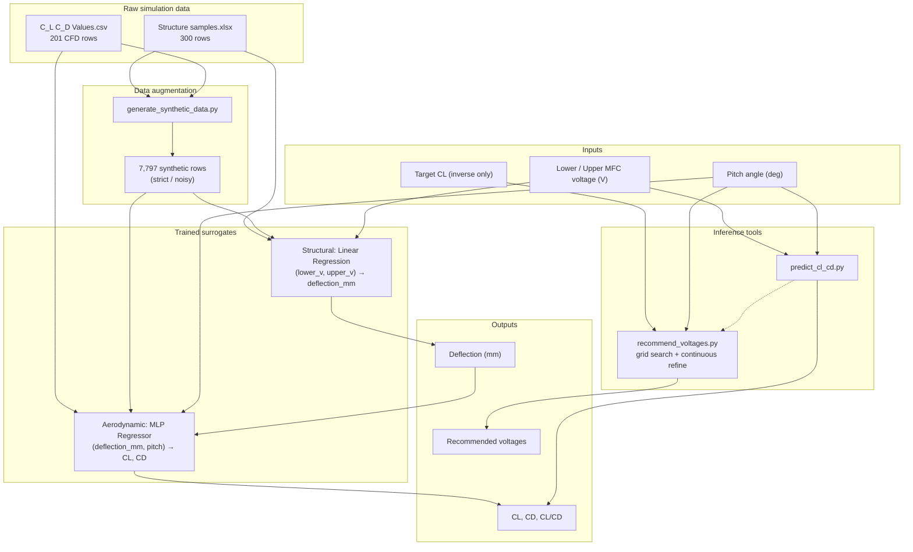

# IDP Phase 2 — Results Summary

**Project:** Data-Driven ML Framework for Piezoelectric Morphing Wings  
**Institution:** RV College of Engineering  
**Pipeline status:** Complete (software surrogate framework)

---

## 1. Project objective

Build a fast, data-driven surrogate to replace expensive ANSYS/Fluent simulations for a piezo-actuated morphing NACA0009 wing, enabling:

1. **Forward prediction:** MFC voltages + pitch → trailing-edge deflection → \(C_L, C_D\)
2. **Inverse control:** desired \(C_L\) at a given pitch → recommended MFC voltages

---

## 2. Overall pipeline flow



---

## 3. Input data summary

### 3.1 Structural dataset (`Structure samples.xlsx`)

| Property | Value |
|----------|-------|
| Rows | 300 |
| Lower MFC voltage | −500 V to −50 V (step 50 V) |
| Upper MFC voltage | 50 V to 1500 V (step 50 V) |
| Output | Trailing-edge deflection (mm) |
| Deflection range | −0.37 mm to −8.47 mm |

### 3.2 Aerodynamic dataset (`C_L C_D Values - Sheet1.csv`)

| Property | Value |
|----------|-------|
| Rows | 201 |
| Lower MFC voltage | −500 V to −50 V (step 50 V) |
| Upper MFC voltage | 50 V, 750 V, 1500 V only |
| Pitch angles | −4°, 0°, 4°, 8°, 12°, 16°, 20° |
| Outputs | \(C_L\), \(C_D\) |
| \(C_L\) range | 0.00408 – 0.3079 |
| \(C_D\) range | 0.01311 – 0.13997 |

### 3.3 Wing / actuation setup (fixed design parameters)

| Parameter | Value |
|-----------|-------|
| Airfoil | NACA 0009 |
| Chord | 127 mm |
| Morphing region | Trailing edge (80% chord) |
| TE thickness | 1.5 mm |
| MFC type | M-8557 P1 (d33) |
| MFC count | 4 (bimorph upper/lower) |
| Voltage operating range | −500 V to +1500 V |

---

## 4. Model training results

### 4.1 Structural surrogate — \((lower\_v, upper\_v) \rightarrow\) deflection

Evaluated on original 300 structural simulation points.

| Model | MAE (mm) | RMSE (mm) | R² |
|-------|----------|-----------|-----|
| **Linear Regression** ✅ | **0.00164** | **0.00294** | **0.999998** |
| MLP Regressor | 0.05838 | 0.07143 | 0.99882 |

**Selected for pipeline:** Linear Regression  
**Validation:** 5-fold CV stable; shuffled-label test fails (R² ≈ 0) — no spurious overfitting.

---

### 4.2 Aerodynamic surrogate — \((deflection, pitch) \rightarrow C_L, C_D\)

#### Original training (201 real CFD points)

| Model | \(C_L\) MAE | \(C_L\) R² | \(C_D\) MAE | \(C_D\) R² |
|-------|-------------|------------|-------------|------------|
| Linear Regression | 0.00591 | 0.981 | 0.00956 | 0.828 |
| MLP Regressor | 0.01014 | 0.956 | 0.01066 | 0.700 |

#### Retrained on augmented data (evaluated on real CFD points only)

| Model | \(C_L\) MAE | \(C_L\) R² | \(C_D\) MAE | \(C_D\) R² |
|-------|-------------|------------|-------------|------------|
| Linear Regression | 0.00529 | 0.991 | 0.00952 | 0.860 |
| **MLP Regressor** ✅ | **0.00222** | **0.998** | **0.00209** | **0.991** |

**Selected for pipeline:** Retrained MLP (`retrained_strict/aerodynamic_mlp_regressor.joblib`)

---

### 4.3 Full chained model — voltages → deflection → \(C_L, C_D\)

Evaluated on all 201 real CFD rows.

| Chain configuration | \(C_L\) MAE | \(C_D\) MAE |
|---------------------|-------------|-------------|
| Structural Linear + Aero Linear (original) | 0.00502 | 0.00927 |
| **Structural Linear + Aero MLP (current)** ✅ | **0.00222** | **0.00211** |

**Spot validation** — lower = −50 V, upper = 750 V, pitch = 8°:

| Quantity | CFD truth | Chained prediction | Abs. error |
|----------|-----------|-------------------|------------|
| Deflection (mm) | −3.7164 | −3.7158 | 0.0006 |
| \(C_L\) | 0.11415 | 0.11483 | 0.00068 |
| \(C_D\) | 0.03681 | 0.03304 | 0.00377 |

---

## 5. Synthetic data augmentation

Generated via physics-consistent interpolation:

1. Bilinear interpolation of deflection on \((lower\_v, upper\_v)\) grid (25 V step)
2. Linear interpolation of \(C_L, C_D\) in \((deflection, pitch)\) space
3. Optional residual-bootstrap noise (`--mode noisy --noise-scale 1.0`)

| Dataset | Rows | Location |
|---------|------|----------|
| Strict synthetic only | 7,797 | `outputs_synthetic_data/synthetic_dataset_strict.csv` |
| Noisy synthetic only | 7,797 | `outputs_synthetic_data/synthetic_dataset_noisy.csv` |
| Augmented structural | 1,121 | `outputs_synthetic_data/structural_augmented_strict.csv` |
| Augmented aerodynamic | 7,998 | `outputs_synthetic_data/aerodynamic_augmented_strict.csv` |

---

## 6. Inverse voltage search

**Tool:** `recommend_voltages.py`  
**Method:** Grid search (50 V steps) → continuous L-BFGS-B refinement → rank by CL error, CD violation, total voltage

| Feature | Description |
|---------|-------------|
| Input | Target \(C_L\), pitch angle |
| Optional constraint | `--max-cd` (maximum drag coefficient) |
| Output | Top-k voltage pairs with predicted \(C_L, C_D\) |

### Example results

**Case A — no CD limit**  
Target: \(C_L = 0.15\), pitch = 8°

| Lower V | Upper V | Predicted \(C_L\) | Predicted \(C_D\) | CL error |
|---------|---------|-------------------|-------------------|----------|
| −250 | 1000 | 0.15007 | 0.05751 | 0.00007 |

**Case B — with CD limit**  
Target: \(C_L = 0.15\), pitch = 8°, max \(C_D = 0.05\)

| Result | Value |
|--------|-------|
| \(C_L = 0.15\) achievable? | **No** (under current surrogate) |
| Best feasible | lower = −300 V, upper = 600 V |
| Predicted \(C_L\) | 0.1196 |
| Predicted \(C_D\) | 0.0499 ✅ |

---

## 7. Software toolkit

| Script | Purpose |
|--------|---------|
| `data_loaders.py` | Load structural Excel + CFD CSV |
| `train_structural_surrogates.py` | Train structural models |
| `train_aerodynamic_surrogates.py` | Train aerodynamic models (original data) |
| `generate_synthetic_data.py` | Generate strict/noisy augmented CSVs |
| `train_augmented_surrogates.py` | Retrain on augmented data |
| `surrogate_chain.py` | Core chained + inverse search logic |
| `predict_deflection.py` | Voltage → deflection |
| `predict_cl_cd.py` | Voltage + pitch → \(C_L, C_D\) |
| `recommend_voltages.py` | Target \(C_L\) + pitch → voltages |
| `plot_structural_response_surfaces.py` | 2D/3D deflection response plots |
| `run_inverse_search_demo.py` | Demo all inverse search modes |

### Environment

```powershell
& "c:\Users\akash\Desktop\IDP\.venv\Scripts\Activate.ps1"
```

### Quick run commands

```powershell
# Forward prediction
python predict_cl_cd.py --upper-v 750 --lower-v -50 --pitch-deg 8

# Inverse recommendation
python recommend_voltages.py --target-cl 0.15 --pitch-deg 8 --max-cd 0.05 --top-k 5
```

---

## 8. Output artifacts

| Directory | Contents |
|-----------|----------|
| `outputs_structural_surrogates/` | Structural models, metrics, parity & response plots |
| `outputs_aerodynamic_surrogates/` | Original aero models, metrics, parity plots |
| `outputs_synthetic_data/` | Strict/noisy synthetic + augmented CSVs |
| `outputs_augmented_models/` | Retrained strict/noisy model sets |
| `outputs_inverse_search/` | Inverse search demo CSVs |

---

## 9. What is complete vs. remaining

### ✅ Complete (software / ML pipeline)

- [x] Data ingestion and cleaning
- [x] Structural surrogate (voltage → deflection)
- [x] Aerodynamic surrogate (deflection + pitch → \(C_L, C_D\))
- [x] Physics-consistent synthetic data generation
- [x] Retraining on augmented data
- [x] Chained forward inference
- [x] Inverse voltage search with CD constraint and refinement
- [x] Validation on real simulation data (no synthetic leakage in evaluation)

### ⏳ Remaining (project scope beyond code)

- [ ] Extract camber ratio and camber location from morphed geometry
- [ ] Include Reynolds number as an explicit model input
- [ ] Additional CFD runs at intermediate upper voltages
- [ ] Prototype fabrication and wind-tunnel validation
- [ ] Final report integration with experimental comparison

---

## 10. Key conclusions

1. The voltage–deflection relationship is highly linear; **linear regression** is the best structural surrogate (\(R^2 \approx 1.000\)).
2. The aerodynamic mapping benefits from augmentation; the **retrained MLP** significantly improves \(C_D\) prediction (\(R^2\): 0.83 → 0.99 on real data).
3. The full chained surrogate achieves **\(C_L\) MAE = 0.0022** and **\(C_D\) MAE = 0.0021** across all 201 CFD validation points.
4. The inverse search tool fulfills the project control objective: **given desired lift at a pitch angle, recommend MFC voltages** — with optional drag constraints.
5. The framework is fast, reproducible, and ready for integration into the Phase 2 report; experimental validation is the recommended next step.

---

*Generated from the IDP surrogate pipeline — June 2026*
